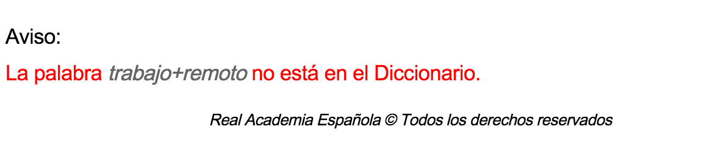
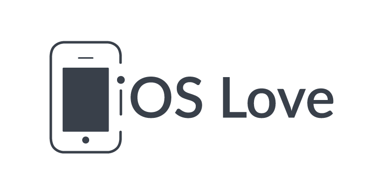
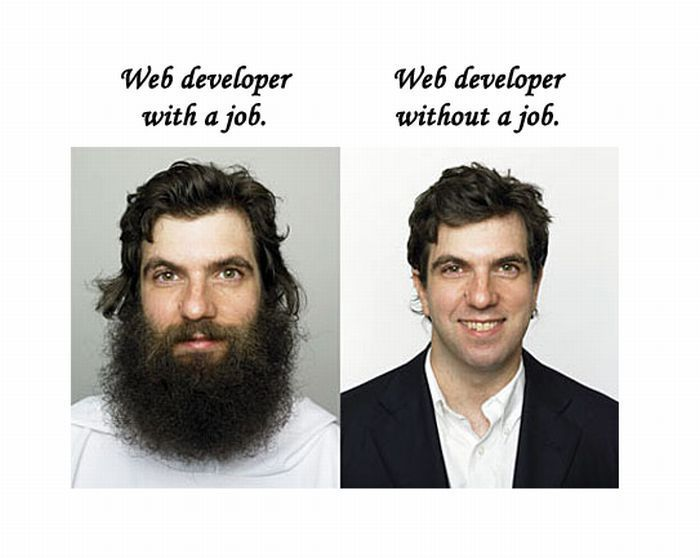
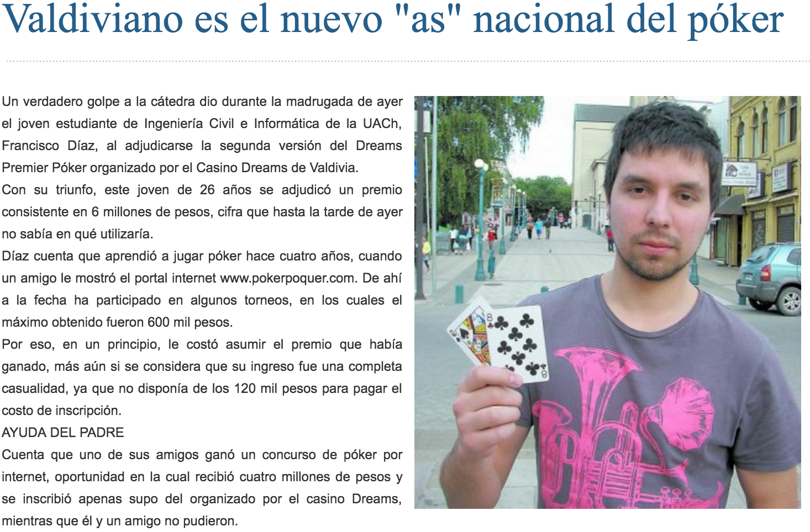
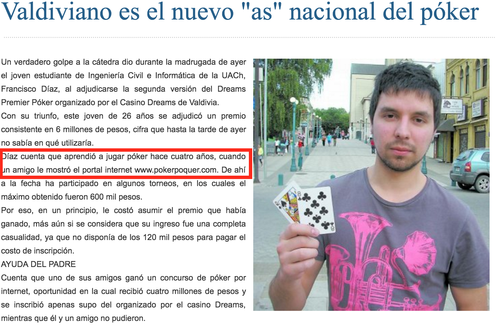
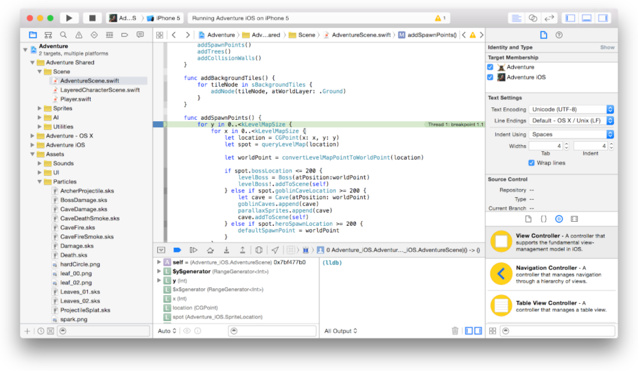
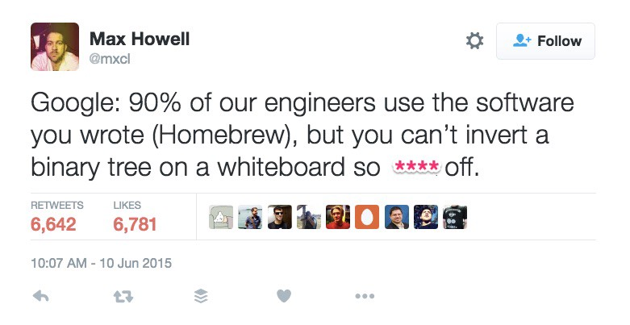
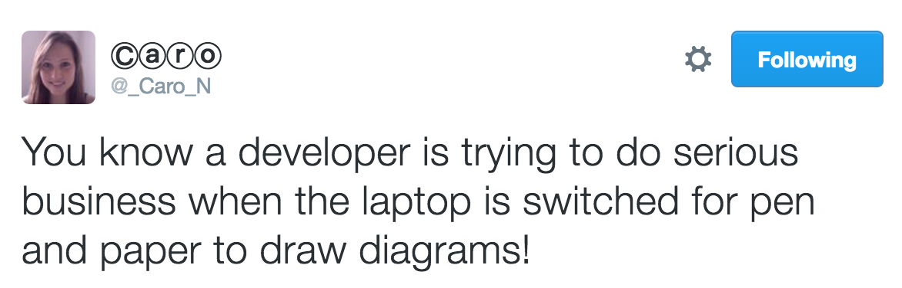
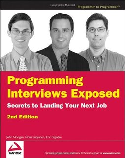
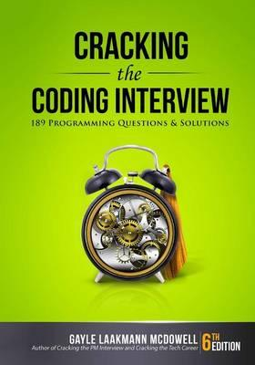

# ¿De qué hablo 
## cuando hablo de 
#[fit] trabajo remoto?

--- 

## ¿Qué es 
#[fit] trabajo remoto?

--- 

---

# Teletrabajo

---

> _Trabajo_ que se realiza desde un lugar fuera de la empresa utilizando las redes de telecomunicación para cumplir con las cargas laborales asignadas.
-- RAE

---

## ¿Qué es 
# trabajo?

---

> Acción y efecto de _trabajar_.
-- RAE

---

## ¿Qué es 
# trabajar?

---

> Ejercer determinada _profesión_ u oficio.
-- RAE

---

## ¿Qué es una
# profesión?

---

> Conjunto de personas que ejercen una misma _profesión_.
-- RAE

---

---

> Conjunto de _personas_ que ejercen una misma profesión.
-- RAE

---

## ¿Qué es una **persona**?

---

## ¿Quién **soy**?

---

# [fit] Francisco Díaz 
# @fco_diaz

---

# [fit] Desarollador iOS

---

# Objective-C
## 🤒

---

# Swift
## 😎
 
---

## ~~Unico~~ más grande 
# de Chile

---

---

---

---

---

---

---

 

---

---

> Díaz cuenta que aprendió a jugar póker hace cuatro años, cuando un amigo le mostró el _portal internet_ www.pokerpoquer.com
-- Diario Austral

---

# Primer 
## trabajo remoto

---

---

---

# Entrevista a 
## la gran capital

---

---

# Santiago

---

# ¿Cuál es tu 
## mayor fortaleza?

---

# ¿Cuál es tu 
## mayor debilidad?

---

---

# 💩

---

---

---

---

---

> Being a good programmer has a surprisingly small role in passing programming interviews.
-- Somebody at Hacker News

---

# "Whiteboard coding"

---

---

---

---

## Por un nuevo 
## proceso 
## de entrevistas

---

---

## Conoce a la persona que estás entrevistando.

---

## Interésate por la persona que estás entrevistando

---

## Conversa
## No interrogues

---

## Contexto

---

## No humillen

---

## Aprendamos

---

---

---

## ¿Cómo gané 
# dinero
## jugando poker?

---

# Play money

---

---

---

---

---

---

# Prueba y error

---

---

---

---

---

# Sindrome del 
## impostor

---

# Deja el ego fuera

---

# Libros

---

> Un libro es más de lo que un programador promedio lee en un año
-- DeMarco and Lister, Peopleware

---

# Busca un mentor

---

# Comparte

---

# ¿Por qué 
## no seguí 
# [fit] jugando poker?

---

# PokerPoquer cerro

---

# ¿Por qué 
## seguí 
# [fit] desarrollando software?

---

# Volver 
## a pensar como un 
# novato

---

# Aprendizaje Continuo

---

# Encontré una comunidad

---

# Equipos vs Proyectos

---

# Equipos pequeños

---

# Grupos de Estudio

---

# Code Reviews

---

# Compartir conocimiento

---

# Transparencia

---

# ¿5 horas de diferencia?

---

# Ya tenemos horas de diferencia

---

# Asíncrono

---

# Eliminar el email

---

# Slack

---

# Pull Requests

---

# Code reviews

---

# ZenHub

---

# ¿Qué es urgente?

---

# ¿De qué hablo 
## cuando hablo de 
#[fit] trabajo remoto?

---

# 1. Crecimiento

---

# 2. Comunidad

---

# ¡Gracias! 👏

### github.com/fdiaz/9punto5-talk